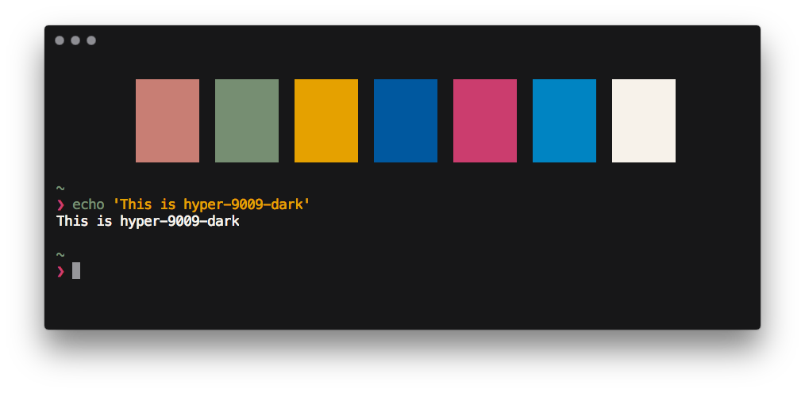

# hyper-9009

> A modified Hyper theme based on [hyper-snazzy](https://github.com/sindresorhus/hyper-snazzy)



## Install

```
$ hyper install hyper-9009
```

## Explanation
The idea behind the theme was inspired from both [GMK 9009](https://dixiemech.com/shop/gmk9009) and [hyper-snazzy](https://github.com/sindresorhus/hyper-snazzy). It was originally an experiment of showing printing colors on terminal, and it turns out to be okay. To make your terminal aligned with the screenshot, [pure-9009](https://github.com/RichoHan/pure-9009) is recommended (also a modified version of [pure](https://github.com/sindresorhus/pure)). Note that most of work was done by the original author [Sindre Sorhus](https://github.com/sindresorhus) and relative team members.  

For all colors used in the theme, please check the table below.

### Core Colors in [GMK 9009](https://dixiemech.com/shop/gmk9009) & Others Selected from [GMK Colors](https://www.reddit.com/r/MechanicalKeyboards/comments/4sy0lo/gmk_colors/)
|Color|GMK Code|Representation|RGB|
|:-:|:-:|:-:|:-:|
|Foreground|CR||#171718|
|_Unused_|U9||#aca693|
|_Unused_|L9||#d8d2c3|
|Background|WS1||#f7f2ea|
|Green|3B||#768e72|
|Red|3A||#c87e74|
|Yellow|N6||#e5a100|
|Blue|V4||#00589f|
|Magenta|MG1||#cb3d6e|
|Cyan|N5||#0084c2|

## License
MIT

> Copyright for portions of project [hyper-9009](https://github.com/RichoHan/hyper-9009) are held by [[Sindre Sorhus](sindresorhus.com), 2017] as part of project [hyper-snazzy](https://github.com/sindresorhus/hyper-snazzy). All other copyright for the rest of the project are held by [[Richo Han](richo.tw), 2018].
